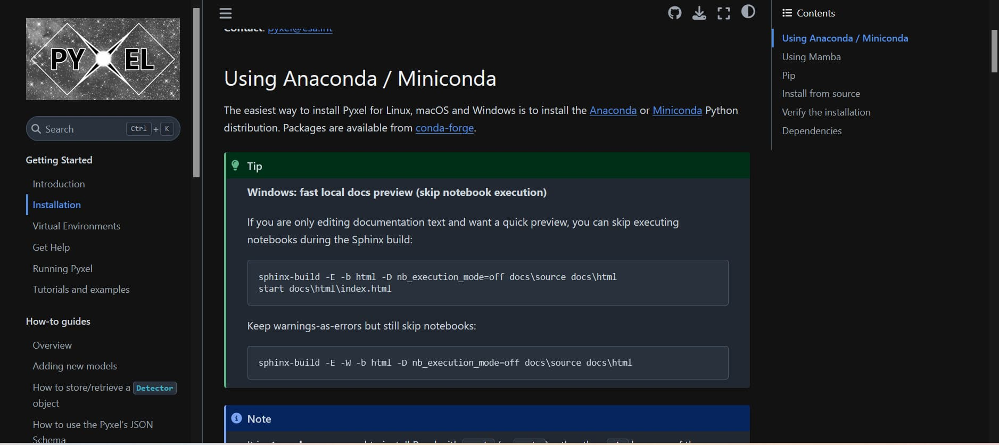

# MR 1092 — Windows tip for fast local preview; tidy wording

Scope: `docs(install)`  
Status: Open

---

## Why

Windows contributors hit notebook-execution errors locally. A quick tip to skip execution
makes text-only edits easy and welcoming.

---

## Change overview: 

  
   <em>Figure: My local Sphinx build after adding the Windows tip.</em>

