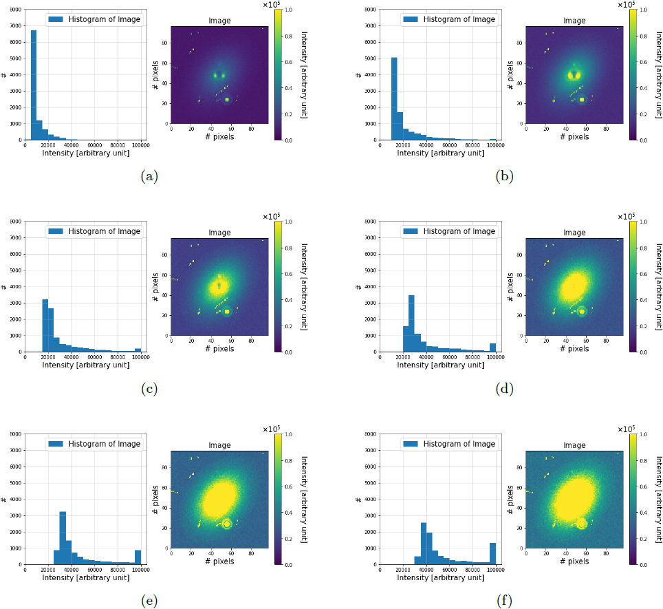

.. _readout_electronics:

==========================
Readout Electronics models
==========================

.. currentmodule:: pyxel.models.readout_electronics

Readout electronics models are used to add TBW.

Simple ADC
==========

:guilabel:`Signal` 🠆 :guilabel:`Image`

With this model you can convert :py:class:`~pyxel.data_structure.Signal`
array into :py:class:`~pyxel.data_structure.Image` mimicking an ideal Analog to Digital Converter (ADC).
The parameters ``adc_bit_resolution`` and ``adc_voltage_range`` from detector
:py:class:`~pyxel.detectors.Characteristics` are used.
Output data_type can also be specified with the parameter ``data_type``, default is ``uint32``.

Example of the configuration file:

.. code-block:: yaml

    - name: simple_adc
      func: pyxel.models.readout_electronics.simple_adc
      enabled: true
      arguments:
        data_type: uint32   # optional

.. autofunction:: simple_adc

Simple amplification
====================

:guilabel:`Signal` 🠆 :guilabel:`Signal`

Amplify signal using gain from the output amplifier (in V/V) and
the signal processor (in V/V).

Example of the configuration file:

.. code-block:: yaml

    - name: simple_amplifier
      func: pyxel.models.readout_electronics.simple_amplifier
      enabled: true

.. autofunction:: simple_amplifier

DC crosstalk
============

:guilabel:`Signal` 🠆 :guilabel:`Signal`

Apply DC crosstalk signal to detector signal.

Example of the configuration file:

.. code-block:: yaml

    - name: dc_crosstalk
      func: pyxel.models.readout_electronics.dc_crosstalk
      enabled: true
      arguments:
        coupling_matrix: [[1, 0.5, 0, 0], [0.5, 1, 0, 0], [0, 0, 1, 0.5], [0, 0, 0.5, 1]]
        channel_matrix: [1,2,3,4]
        readout_directions: [1,2,1,2]

.. autofunction:: dc_crosstalk

AC crosstalk
============

:guilabel:`Signal` 🠆 :guilabel:`Signal`

Apply AC crosstalk signal to detector signal.

Example of the configuration file:

.. code-block:: yaml

    - name: ac_crosstalk
      func: pyxel.models.readout_electronics.ac_crosstalk
      enabled: true
      arguments:
        coupling_matrix: [[1, 0.5, 0, 0], [0.5, 1, 0, 0], [0, 0, 1, 0.5], [0, 0, 0.5, 1]]
        channel_matrix: [1,2,3,4]
        readout_directions: [1,2,1,2]

.. autofunction:: ac_crosstalk

Dead time filter
================

:guilabel:`Phase` 🠆 :guilabel:`Phase`

This model only applies to the :py:class:`~pyxel.detectors.MKID` detector.

There is a maximum limit to the achievable count rate, which is inversely proportional to the minimum distance in time between distinguishable pulse profiles: the so-called “dead time”, which is fundamentally determined by the recombination time of quasi-particles re-forming Cooper pairs. The following is a mosaic of simulations---from :cite:p:`2020:prodhomme`---showing the effect of temporal saturation for an MKID-array, which leads to an intensity saturation; by incrementally increasing the brightness level in the field of view, from (a) to (f). The effect appears when the interval between the arrival time of two photons is smaller than the dead time of the affected MKIDs in the array, assuming an ideal read-out bandwidth. The sequence of associated histograms shows how the counts ($\#$) move towards higher intensities, until the wall of :math:`10^5` (in arbitrary units) is reached.

The underlying physics of this model is described in :cite:p:`PhysRevB.104.L180506`; more information can be found on the website :cite:p:`Mazin`.

Example of the configuration file:

.. code-block:: yaml

    - name: dead_time_filter
      func: pyxel.models.readout_electronics.dead_time_filter
      enabled: true
      arguments:
        tau_0: 4.4e-7
        n_0: 1.72e10
        t_c: 1.26
        v: 30.0
        t_op: 0.3
        tau_pb: 2.8e-10
        tau_esc: 1.4e-10
        tau_sat: 1.0e-3

.. note:: This model is specific to the :term:`MKID` detector.

.. autofunction:: dead_time_filter

SAR ADC
=======

:guilabel:`Signal` 🠆 :guilabel:`Image`

Digitize signal array using SAR (Successive Approximation Register) :term:`ADC` logic.
The parameters ``adc_bit_resolution`` and ``adc_voltage_range`` from detector
:py:class:`~pyxel.detectors.Characteristics` are used.

Example of the configuration file:

.. code-block:: yaml

    - name: sar_adc
      func: pyxel.models.readout_electronics.sar_adc
      enabled: true

.. autofunction:: sar_adc

Simple phase conversion
=======================

:guilabel:`Phase` 🠆 :guilabel:`Image`

With this model you can convert :py:class:`~pyxel.data_structure.Phase`
array into :py:class:`~pyxel.data_structure.Image`, given a hard-coded multiplicative conversion factor.

Example of the configuration file:

.. code-block:: yaml

    - name: simple_phase_conversion
      func: pyxel.models.readout_electronics.simple_phase_conversion
      enabled: true

.. note:: This model is specific to the :term:`MKID` detector.

.. autofunction:: simple_phase_conversion
